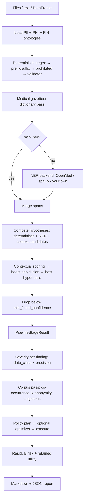

# Seiba Sensitive Data Scanner

**Find sensitive data in your files, score how exposed it makes people, and de-identify it — with every number traceable to the rule that produced it.**

Copyright © 2026 Seiba AI. Licensed under the [Apache License 2.0](LICENSE).

<!-- TODO(badges): add CI, PyPI version, Python versions, License badges once CI + PyPI publish exist -->

> **Disclaimer:** This software finds and scores *candidate* sensitive values. It is **not** legal advice, **not** a certified de-identification or Safe Harbor solution, and **not** a guarantee of regulatory compliance (HIPAA, GDPR, or otherwise). You remain responsible for validating outputs in your environment. See [Limitations](#limitations).

---

## The problem

You have a dataset — clinical notes, a patient registry, a CSV of customer records — and before you can share it, train on it, or move it, you need to answer four questions:

1. **What sensitive data is in here?**
2. **How exposed are the people in it?**
3. **What should be done about it?**
4. **Did that work, and what did it cost?**

Most PII tools answer only the first, and answer it as a black box: a list of spans, a confidence number, no explanation. Seiba answers all four and shows its work — every severity score carries a rule trace, every policy action names the rule that chose it, and every quality claim is backed by a reproducible evaluation you can re-run.

**Where it fits:** OpenMed is the engine room — Seiba wraps it for prose NER, de-identification primitives, k-anonymity and re-identification scoring. Seiba owns what OpenMed doesn't: structured/tabular scanning, the severity engine, the ontology as stable entity-ID currency, and the risk-vs-utility optimization loop. This is not a competing PII SDK; it is an assessment product built on top of one.

---

## Features

**Detection**
- Layered pipeline: deterministic regex + validators → medical gazetteer → contextual scoring → multi-hypothesis fusion → NER
- Swappable NER backends: `openmed` (default), `spacy`, or bring your own model with two factory helpers
- **84 entities** across three ontology YAMLs (PII / PHI / financial) — rules live in config, not code
- Structured-aware: column-key relabeling, batched NER over unique cells, validated-ID short-circuit
- Full provenance per finding: which stage won, per-source confidence, rescue flags

**Assessment**
- Severity from `data_class`, deliberately **decoupled from detector confidence** (confidence routes to human review instead of quietly discounting severity)
- Precision-aware: a bare year scores lower than a full date of birth
- Corpus escalation: co-occurring identifier types, singleton-record uniqueness
- k-anonymity / re-identification risk, HIPAA Safe Harbor 18-category checklist, regulatory mapping, review queue

**Policy & de-identification**
- OpenMed policy profiles (`hipaa_safe_harbor` by default)
- Actions: `keep | mask | redact | hash | replace | format_preserve | generalize`
- **Generalization is Seiba-owned** — coarsen instead of destroy (a date to its year, a zip to its region)
- Per-entity actions configured in YAML; runtime overrides per run

**Optimizer** (off by default)
- One argument: `Privacy.MAXIMUM | BALANCED | REQUIRED`
- Picks the *least destructive* action per entity that still meets a privacy target

**Reporting**
- Markdown + JSON written together, plain-language throughout, with a glossary per table
- Exposure before vs after de-identification, residual risk, retained analytic value

---

## Installation

Requires **Python 3.10+**.

```bash
pip install seiba-risk-scanner
```

<!-- TODO(packaging): confirm the published PyPI name once TestPyPI/PyPI publish lands; until then this is install-from-source only -->

From source:

```bash
git clone https://github.com/seiba-ai/seiba-risk-scanner.git
cd seiba-risk-scanner
pip install -e .
```

OpenMed installs automatically — it powers the default NER backend, policy profiles, k-anonymity and residual risk. **All inference is local; no data leaves your machine.**

**Optional extras**

| Extra | Install | Adds |
|---|---|---|
| `ner-spacy` | `pip install -e ".[ner-spacy]"` | spaCy backend (`en_core_web_sm` downloads automatically on first use) |
| `ner-hf` | `pip install -e ".[ner-hf]"` | bring-your-own HuggingFace token-classification models |
| `llm` | `pip install -e ".[llm]"` | optional LLM refinement stage |
| `dev` | `pip install -e ".[dev]"` | pytest, ruff, mypy |

---

## Quickstart (2 minutes)

Point it at files or folders and get a report:

```python
from seiba_risk_scanner.assessment import report_from_paths

report = report_from_paths(["patients.csv"], out_dir="reports", health_context=True)

print(report.exposure_index)                    # 64.6  (0 = nothing found, 100 = maximally exposed)
print(report.severity_histogram)                # {critical: 84, high: 120, medium: 96, ...}
print(len(report.review_queue))                 # 43 findings a human should confirm
```

That writes `reports/readiness_report.md` (human-readable) and `reports/readiness_report.json` (every record, machine-readable).

Text (`.txt`, `.md`) is scanned as documents, one record each. Tabular (`.csv`, `.json`) is scanned cell by cell, one record per row. You can mix both in one call.

> **`health_context=True` matters.** A patient registry of name/email/phone/zip is byte-identical to a marketing list — the scanner genuinely cannot tell them apart. Setting this flag is what makes the Safe Harbor identifiers around your clinical data get tagged as HIPAA-regulated.

---

## Python API

### Just find spans

```python
from seiba_risk_scanner import SeibaScanner

scanner = SeibaScanner()
result = scanner.classify_text("Contact Emily Davis at emily@example.com, MRN BH-MRN-789456.")

for row in result.detections:
    print(row.entity_id, row.start, row.end, row.text, round(row.confidence, 2))
```

```
pii_entity_ontology::person_names   8  19  Emily Davis        0.87
pii_entity_ontology::email_address 23  40  emily@example.com  0.99
phi_entity_ontology::medical_record_number_mrn 47 60 BH-MRN-789456 0.94
```

### Structured data

```python
rows = [{"name": "Emily Davis", "city": "Austin", "mrn": "789456"}]
result = scanner.classify_structured_text(rows)
```

Column names are used as evidence: `"Austin"` under a `city` column is typed as a city, not guessed as a person's name.

### Many documents at once

```python
results = scanner.classify_texts([doc1, doc2, doc3])   # one batched NER pass, ~15x faster
```

### Assess, apply a policy, and measure the result

```python
from seiba_risk_scanner.assessment import ReadinessAssessor, scan_paths

results, labels = scan_paths(["notes/"])
assessor = ReadinessAssessor(policy="hipaa_safe_harbor", execute_policy=True)
report = assessor.assess(results, labels=labels, health_context=True)

print(report.residual_severity.exposure_index_before,   # 64.6
      report.residual_severity.exposure_index_after)    # 8.1
print(report.utility.overall)                           # 0.73 → 27% of analytic value retained
```

### Let the optimizer choose actions

```python
from seiba_risk_scanner.assessment.optimize import Privacy

assessor = ReadinessAssessor(optimize=Privacy.BALANCED)
report = assessor.assess(results, labels=labels)

for entity, action in report.optimization.overrides.items():
    print(entity, action, report.optimization.reasons[entity])
```

Instead of masking everything, it finds the gentlest action per field that still hits the privacy target. Measured tradeoff across presets: **MAXIMUM 5% → BALANCED 27% → REQUIRED 43%** of analytic value retained.

### Swap the NER backend, or bring your own

```python
scanner = SeibaScanner(ner_backend="spacy")                       # built-in alternative
scanner = SeibaScanner(ner_backend="openmed", ner_model="<id>")   # any OpenMed model

from seiba_risk_scanner import make_hf_ner_runner, make_custom_ner_runner
runner = make_hf_ner_runner("my-org/my-ner-model", "my_labels.yaml")
runner = make_custom_ner_runner(my_model.predict, {"PER": "pii_entity_ontology::person_names"})
scanner = SeibaScanner(ner_runner_override=runner)
```

You supply the label→entity_id map, since only you know your model's labels. Unmapped labels are dropped.

---

## Command line

**There is no packaged CLI in v0.1** — Seiba is a Python SDK. The evaluation harness has a command-line interface, but it ships in the repository rather than the installed package, so it is available to people who clone the repo:

```bash
python3 -m eval.runner --ner-backend openmed      # score against gold, write a report
python3 -m eval.structured_runner                 # score the structured fixtures
python3 -m eval.compare <run-a> <run-b>           # diff two runs
```

<!-- TODO(cli): a packaged `seiba` CLI (scan a path, emit a report, --optimize / --action-overrides flags) is on the roadmap; decide whether it lands in 0.2 -->

---

## Output schema

Every scan returns a `PipelineStageResult` holding `CombinedDetectionRow` items. Every assessment returns a `SensitiveDataReadinessReport`. Both are Pydantic models — call `.model_dump(mode="json")` for plain JSON.

### A finding (`CombinedDetectionRow`)

| Field | Type | Meaning |
|---|---|---|
| `entity_id` | `str` | Stable ID: `{ontology_stem}::{entity_name}` |
| `entity` | `str` | Entity name from the ontology YAML |
| `start`, `end`, `text` | `int`, `int`, `str` | Character span and matched text |
| `confidence` | `float` | Fused score used for thresholding (0–1) |
| `confidence_deterministic` / `_contextual` / `_ner` / `_llm` | `float` | Per-source contribution — this is the audit trail |
| `winner_kind` | `str` | Which hypothesis won: `deterministic` \| `ner` \| `context_candidate` \| `llm` |
| `rescue_applied` | `bool` | Context relabeled a weak match — worth a human look |
| `original_entity_id` | `str?` | What it was labeled as before the rescue |
| `detected_subtype` | `str?` | Finer entity rolled up to its parent (a physician reported as a person) |
| `provenance` | `dict?` | Source location: `{column, row}` for tabular, gazetteer canonical/code when matched |

### A report (`SensitiveDataReadinessReport`)

| Field | Meaning |
|---|---|
| `exposure_index` | 0–100. **Not a grade** — see [Severity](#severity-and-exposure) |
| `exposure_breakdown` | Why the index is what it is, including whether uniqueness was measured at all |
| `findings` | Every finding with its severity verdict and full `rule_trace` |
| `severity_histogram` | Count per severity level |
| `per_entity` / `per_record` | Rollups by data type and by person |
| `heatmap` | Location × severity grid — which columns hold the risk |
| `hipaa_checklist` | All 18 Safe Harbor categories, present or absent |
| `compliance_summary` | Findings in scope per regulation (GDPR / CCPA / HIPAA / PCI) |
| `review_queue` | Severe findings the scanner is not confident about |
| `reidentification` | k-anonymity: `k_min`, singletons, records below threshold, the traits compared |
| `policy_plan` | The action taken on every finding, and the rule that chose it |
| `residual_severity` | Exposure before vs after the scrub |
| `utility` | Analytic value destroyed, measured on the real output |

**Fields are `None` when something was not measured, never 0.** Re-identification below a real population, utility before a policy runs — these report "not measured" rather than a fabricated number.

---

## Entity taxonomy

**84 entities** in three bundled ontologies:

| Ontology | Entities | Scope |
|---|---|---|
| `pii_entity_ontology` | 44 | Identity, contact, geography, government IDs, dates |
| `phi_entity_ontology` | 31 | Clinical and administrative PHI, codes, biometrics |
| `fin_entity_ontology` | 9 | Cards, accounts, routing, IBAN |

Each entity declares a **`data_class`**, which is the single anchor for severity and for the direct/quasi split that re-identification needs:

| `data_class` | Count | Severity | Meaning |
|---|---|---|---|
| `direct_identifier` | 38 | 0.90 | Names a specific person outright |
| `genetic_data` | 2 | 0.90 | Identifies *and* is a protected value |
| `biometric_identifier` | 4 | 0.90 | Fingerprints, retinal scans, voiceprints |
| `financial_data` | 8 | 0.85 | Cards, accounts, wallets |
| `sensitive_attribute` | 10 | 0.80 | The protected values k-anonymity guards |
| `device_identifier` | — | 0.60 | MAC, IMEI, serials |
| `quasi_identifier` | 18 | 0.55 | Harmless alone; combines to single someone out |
| `neutral` | 4 | 0.30 | Not personal data — no regime applies |

Of the 84: **65** carry an OpenMed `de_identifier` label for exact policy lookup (the rest fall back via `data_class`), **24** have format validators, and **30** are pattern-less — detected by NER and context alone.

📖 **[Full entity list →](docs/entities.md)** — all 84 entities with their data class, severity, OpenMed label, how each is detected, and which HIPAA Safe Harbor category it reports under.

---

## Severity and exposure

**Severity answers "how bad would this be if exposed" — a fact about the world. Confidence answers "are we sure it is really here" — a fact about the scanner.** These are kept separate on purpose. Multiplying them made a name we were 45% sure of look like mild data, which meant the entities *hardest to detect* were the ones quietly under-reported. Instead, confidence **routes**: severe-but-unsure goes to a human review queue; severity is never discounted.

| Level | Score | Meaning |
|---|---|---|
| `critical` | ≥ 0.93 | Only reachable via corpus context — identifiers stacked in one record, or a unique record |
| `high` | ≥ 0.65 | Harmful on its own — a direct, financial, or health identifier |
| `medium` | ≥ 0.40 | Harmless alone; narrows down who someone is when combined |
| `low` | ≥ 0.20 | Barely sensitive |
| `info` | < 0.20 | Not sensitive |

**A lone finding tops out at HIGH.** CRITICAL requires the second, corpus-wide pass: co-occurring identifier types, or a record that is unique in the population.

**Precision matters.** A bare year scores lower than a full date of birth, because a coarse value links less well against an outside dataset. This applies to dates, ages, zip codes and coordinates.

**The exposure index (0–100) is not a grade.** A clinical registry is *supposed* to hold patient names. Use it to compare datasets, or to track one dataset over time. It is volume-independent (proportions, not counts) and treats unmeasured uniqueness as worst case, so a missing population can never flatter the number.

Every finding carries a `rule_trace` naming each rule that moved its score and by how much.

---

## Configuration

The ontology YAML **is** the config surface. To change what an entity does, edit it:

```yaml
entities:
  date_of_birth:
    regex_patterns:
      accepted_patterns: [...]
      confidence_weight: 0.75
    contextual_phrases:
      values: [dob, date of birth, born on]
      confidence_weight: 0.85
    classification:
      category: PHI
      data_class: quasi_identifier
    de_identifier: DATE_OF_BIRTH      # OpenMed label for exact policy lookup
    default_action: generalize:year   # coarsen to the year instead of destroying it
```

`default_action` options: `DEFAULT` (defer to the policy profile), `keep`, `mask`, `redact`, `hash`, `replace`, `format_preserve`, or `generalize[:level]`. Bad values fail loudly **at load time**, naming the entity.

Generalization ladders (gentlest first): dates `month|year|decade`, ages `5|10|20_year_band`, zips `3_digit|1_digit`, coordinates `1_decimal|integer`. Defaults follow Safe Harbor, which prescribes coarsening rather than deletion for exactly these fields.

Point at your own ontologies with `SeibaScanner(ontology_paths=[...])`, or override actions per run with `ReadinessAssessor(action_overrides={"age": "generalize:10_year_band"})`.

---

## Benchmarks

**Everything below is reproducible:** `python3 -m eval.runner --ner-backend openmed`.

### Entity detection — unstructured text

18 documents, 1,140 gold spans, 46 entity types, OpenMed backend, `type_overlap` matcher:

| Metric | Precision | Recall | F1 |
|---|---|---|---|
| **Micro** | 0.762 | 0.901 | **0.826** |
| **Macro** | 0.805 | 0.889 | **0.821** |
| Strict (exact offsets) | 0.727 | 0.859 | 0.787 |

**20 of 46 entity types score F1 = 1.0.** Strongest at high support: `email_address` 0.995 (support 92), `phone_number` 0.972 (103), `person_names` 0.886 (288), `date_of_birth` 0.978 (22), `zip_code`, `ssn`, `ip_address`, `routing_number_aba` all 1.000.

### Entity detection — structured data

3 fixtures, 1,320 cells, OpenMed backend: **micro F1 1.000**. Structured scanning is a far easier problem — column names are strong evidence, and cells are scored in their own offset window.

### Performance

| Measure | Value |
|---|---|
| Batched throughput | 2,816 ms/document, 326 ms per 1k characters |
| Batch wall time | 50.7s for 18 documents |
| Peak memory | ~700 MB RSS with the OpenMed model loaded |

Batching is what makes this workable: `classify_texts()` and `classify_structured_text()` run NER as one forward pass (~15x faster than looping). Non-prose and validated-ID cells skip the model entirely.

<!-- TODO(benchmarks): document the exact hardware (CPU/GPU, RAM, OS version) these numbers came from — currently unstated, which makes them unreproducible -->

### Methodology

- **Matcher:** `type_overlap` (correct entity type + any character overlap) is the headline; `strict` (exact offsets) is reported alongside. Both are in every run's `report.json`.
- **Gold format:** one JSONL file per document — a `_meta` header line, then one line per span with `start`, `end`, `text`, `entity_id`.
- **Model version:** `OpenMed/OpenMed-PII-SuperClinical-Small-44M-v1`.
- **Regression gate:** `pytest tests/test_eval_regression.py` fails if micro F1 drops by more than 0.01, or any entity with support ≥ 3 drops more than 0.05. It reconstructs the scanner from the *baseline's* recorded config, so a change of defaults cannot silently compare two different pipelines.
- **Artifacts:** every run writes `predictions.jsonl`, plus full false-positive, false-negative and rescue lists — so any number here can be traced to the spans behind it.

### Severity classification accuracy

<!-- TODO(eval): NOT MEASURED. The eval harness grades span detection only — there is no severity/sensitivity gold set and no confusion matrix. Either build one, or state the scope limit explicitly. Do not publish a number until one exists. -->

**Not measured.** The evaluation harness grades *detection* only. Severity is rule-based and fully traced (every finding carries its `rule_trace`), but it has not been benchmarked against human severity judgements. Treat the severity engine as explainable, not as validated.

### Where it is weakest

Published deliberately — these are the numbers a user needs before trusting output:

| Entity | F1 | Why |
|---|---|---|
| `provider_npi` | 0.125 | **A gold-data artifact, not a detection failure** — see below |
| `timestamps` | 0.302 | Over-fires: 33 false positives against 12 gold spans |
| `relative_date_expressions` | 0.500 | "last week", "6 months ago" — genuinely ambiguous |
| `age` | 0.545 | Perfect recall (1.000), poor precision (0.375) — bare numbers read as ages |
| `unique_identifier` | 0.577 | Catch-all bucket; recall 0.455, misses unfamiliar ID shapes |
| `dates` | 0.697 | High recall, many false positives |

**`provider_npi` deserves its own note**, because the number is misleading. NPI carries a checksum validator, and most NPIs in this synthetic corpus are made-up digits that fail it (`1234567890`, `9876543210`). When the checksum fails the entity's confidence drops below `medical_record_number_mrn`, whose broader `\d{5,10}` pattern matches the same span, so MRN wins it. The scanner is behaving correctly and the fixtures are wrong — the one NPI it does find is one of the two that actually validate. **Expect materially better NPI performance on real data.** This is a known fixture defect, not a tuning target.

**Otherwise the pattern is consistent: recall is strong, precision is the weak axis.** Seiba over-flags rather than under-flags — the right default for a compliance tool, but it means the review queue is real work, not a formality. Entities at support < 10 have unstable F1: one span moves the number by 0.1 or more.

By source: deterministic detection contributes 555 true positives / 133 false positives; NER 441 / 132; context candidates 31 / 55 — context rescue is the noisiest stage.

### Dataset composition and its limits

18 documents across clinical notes, discharge summaries, insurance claims, HR files, financial applications, legal contracts, email threads, and deliberately-neutral public text (to catch over-flagging).

**Two limits you should weigh:**
1. **Synthetic.** This corpus contains no real patient data. Real clinical text is messier — abbreviations, typos, inconsistent formatting — so expect lower numbers on it.
2. **Small.** 18 documents is a smoke test with real signal at high support, not a population-scale benchmark. Common industry practice is 200–1,000 documents.

Numbers here are a floor for well-formed English text, not a guarantee for your corpus. **Run the evaluation on your own data before trusting it.**

---

## Comparison with alternatives

<!-- TODO(comparison): no head-to-head benchmark has been run against Presidio, Philter, Phileas, or scrubadub. Do not publish a comparison table until the numbers exist — an unbacked table is worse than none. Note: philter/ and phileas/ are already cloned locally alongside this repo, so a same-gold-set comparison is achievable. -->

**Not yet benchmarked.** A head-to-head comparison against Microsoft Presidio, Philter, and Phileas on the same gold set is planned but has not been run — so no table is published here rather than an unbacked one.

What is distinctive about Seiba, independent of a benchmark:

- **It answers the question after detection.** Most tools return spans. Seiba returns exposure, re-identification risk, a policy plan, and a measurement of what the scrub cost.
- **Severity is decoupled from confidence** — hard-to-detect entities are not quietly under-reported.
- **Everything is traceable.** Every score names the rules that produced it.
- **Coarsen, don't destroy.** Generalization keeps data usable where masking would not.
- **Config is YAML**, so coverage is extended without forking detection logic.

---

## Limitations

**Detection**
- Precision is the weak axis; expect false positives, especially on dates, ages and timestamps.
- **Non-Anglo surname recall is lower than Anglo surname recall.** This is a fairness issue, it is unquantified, and it is on the roadmap. If your population is not predominantly Anglophone, evaluate before relying on name detection.
- English only. No other language is supported or evaluated.
- Photographs and fingerprint scans cannot be detected — only text.
- A HIPAA category showing zero means *the scanner found none*, not that none exist.

**Assessment**
- Health context cannot be inferred from identifiers alone — a patient registry is byte-identical to a marketing list. Pass `health_context=True`.
- Re-identification needs a real population (default: 10+ records). Below that it reports "not measured" rather than a fabricated k.
- Regulatory tagging answers *"is this personal data"* reliably. It does **not** know which jurisdiction binds you — GDPR and CCPA are tagged on every personal-data finding regardless. Read counts as "this much would be in scope *if* that law applies to you."
- Severity is not benchmarked (see above).

**De-identification**
- `ACTION_SEVERITY_RETENTION` — how much severity survives each action (hash 0.15, replace 0.10) — is **a hand-picked estimate, not measured**, and is not currently user-configurable. Utility weights (0.2/0.5/0.3) are a documented judgement call.
- Residual severity recomputes the exposure index and severity histogram only. The HIPAA checklist, compliance summary, per-entity, per-record and review queue still reflect **pre-scrub** state.
- Hash and surrogate values are deterministic (`consistent=True, seed=0`), which makes them dictionary-attackable by an attacker who knows the value space.
- No generalization ladder exists for city/state/county — under the optimizer they can only be kept or masked.

**Operational**
- No packaged CLI in v0.1.
- ~700 MB RSS with the model loaded; plan accordingly for concurrent workers.

---

## Roadmap

**Next**
1. Packaged CLI, with `--optimize` and `--action-overrides` flags
2. Ground `ACTION_SEVERITY_RETENTION` by measurement, or make it configurable and disclosed
3. Extend residual severity to the whole report, or explicitly scope it
4. Severity evaluation set, so the severity engine can be validated and not merely explained
5. Head-to-head benchmark against Presidio / Philter / Phileas on a shared gold set

**Later**
6. Code-range sensitivity ontology (ICD-10, 42 CFR Part 2 ranges → severity)
7. Pareto frontier — report the full risk-vs-retention curve and let a human pick the operating point
8. Grounded retention via simulated linkage attack, measuring the real match rate
9. Geo-hierarchy ladder for city/state
10. Column-level type inference across all values of a column
11. Non-Anglo surname recall

---

## Architecture



**Order in practice:** regex and validators first → gazetteer → optional NER → contextual scoring and hypothesis competition → fused output → optional LLM refinement → assessment → policy → measurement.

**Design rules that hold throughout** (learned the hard way, and worth knowing if you extend this):
- Contextual scoring can only *re-score an existing span*, never create one.
- Fusion is boost-only: context raises the base, never lowers it.
- Every metric states its denominator.
- Unmeasured is reported as unmeasured, never as zero.

---

## Testing

```bash
pip install -e ".[dev]"
pytest
```

171 tests: unit, integration, golden tests against checked-in baselines, and regression tests for specific past bugs.

Four of them run the full eval harness and account for most of the runtime, so they are marked `slow`:

```bash
pytest -m "not slow"   # 167 tests, ~30s — the fast feedback loop
pytest -m slow         # the four quality gates
```

---

## Contributing

See [CONTRIBUTING.md](CONTRIBUTING.md) for setup, checks, and PR expectations. By participating, you agree to the [Code of Conduct](CODE_OF_CONDUCT.md).

Contributions welcome. Extending coverage usually means editing YAML, not Python:

- **Add an entity:** add it to the relevant ontology YAML with patterns, contextual phrases, `data_class` and `de_identifier` — see [docs/entities.md](docs/entities.md#adding-an-entity) for a worked example.
- **Add gold annotations:** drop a `*.gold.jsonl` into `eval/ground_truth/<set>/` and re-run `python3 -m eval.runner`.
- **Change detection behavior:** re-run the eval and include the before/after numbers in your PR. Quality is gated against checked-in baselines, so a change that moves detection without a measurement is not reviewable.

**Never commit real PII or PHI** — in code, tests, fixtures, or issue reports. Use realistic fake data.

---

## Security

Found a vulnerability? **Please report it privately** — see [SECURITY.md](SECURITY.md). Do not open a public issue.

That file also documents the security-relevant limitations you should weigh before relying on Seiba: deterministic surrogates are dictionary-attackable, residual severity is partial, and detection quality varies by population.

---

## License

Copyright © 2026 Seiba AI. Licensed under the Apache License, Version 2.0.

See [LICENSE](LICENSE) and [NOTICE](NOTICE) — the NOTICE covers third-party vocabulary attributions (MONDO, RxNorm, CHV) and their redistribution terms.
