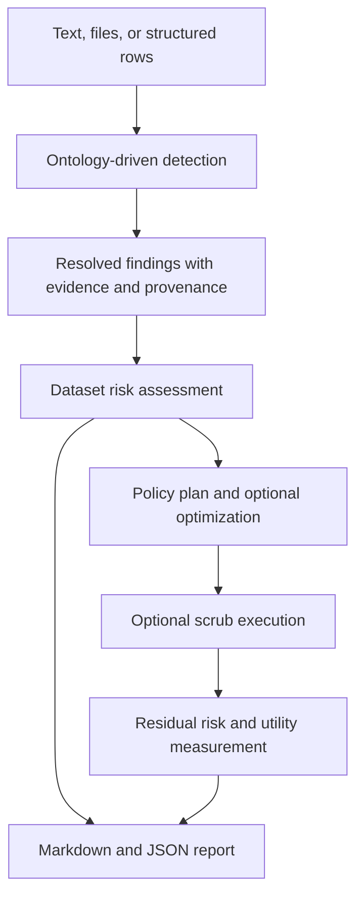

# Architecture

Seiba has four connected responsibilities: detect candidate sensitive values, assess their dataset-level exposure, choose de-identification actions, and measure the result.

## Detection

Detection combines several sources of evidence:

1. Format patterns and validators identify well-structured values such as emails, SSNs, account numbers, and dates.
2. A bundled medical-term dictionary identifies configured clinical concepts.
3. A pluggable NER backend proposes entities in prose.
4. Contextual phrases add evidence around candidate spans.
5. Hypothesis resolution merges overlaps, preserves the strongest valid result, and records how it was chosen.

The output is a finding with stable ontology identity, spans, confidence contributions, the winning detector, and source provenance.

## Assessment

Assessment classifies each finding by its configured data class, then produces dataset-level summaries. It can increase concern when strong identifiers co-occur in a record or when quasi-identifiers make a record unique in a real population. It also produces review, HIPAA, and regulation-scope summaries.

## Policy and measurement

The policy resolver selects an action for every finding. The optional optimizer chooses less destructive actions where they still meet its privacy target. After execution, Seiba compares original and scrubbed values to estimate residual exposure and retained utility.

For supported inputs and result fields, read [inputs and outputs](inputs-and-outputs.md). For settings, read [configuration](configuration.md).
